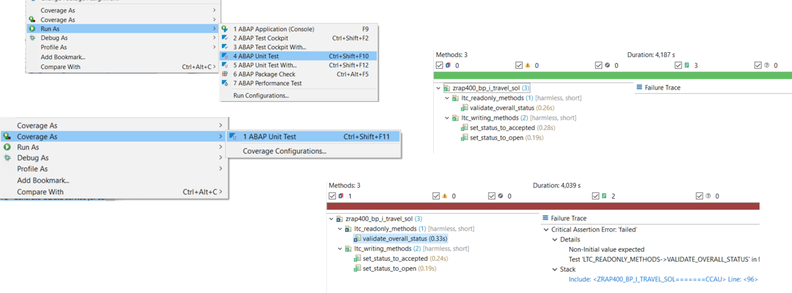

# RAP400 - Writing ABAP Unit Tests for Apps built with the ABAP RESTful Application Programming Model (RAP)
Build and test modern Apps with the ABAP RESTful Application Programming Model (RAP)

## Description
This repository contains the exercise materials for a RAP workshop on testability called **RAP400** - **Writing ABAP Unit Tests for Apps built with the ABAP RESTful Application Programming Model (RAP)** - which is all about quality assurance in the development of modern Apps with RAP.  

## Overview

In this session we will guide you through the development of a transactional UI service and the creation of different types of ABAP Unit tests for a RAP business object (BO) developed with the ABAP RESTful Application Programming Model (RAP) and and the OData service exposing the BO for a transactional SAP Fiori elements-based application.  

The RAP service to be tested with ABAP unit tests will be exposed for a UI use case with the OData V2 protocol, and the resulting app will look like this:

  

  

You will write different ABAP Unit tests in the following exercises to ensure the quality of an OData service developed with the ABAP RESTful Application Programming Model. The OData service is based on the ABAP Flight Reference Scenario. It is the underlying UI service of a SAP Fiori elements based  Travel managing app - i.e. creating, updating and deleting travel records.

        
> **Please Note**  
> The focus of this session is **not** on any development methodology such as Agile/Scrum or test-driven development (TDD), but rather on the technical implementation of unit tests, i.e. how to write ABAP unit tests for a given RAP based applications.
           

## About ABAP Unit Tests

Ensuring the high quality of applications has a very high priority in the whole software development lifecycle. As an application developer, you want to be able to write, for example, unit, scenario and integration tests to verify the application behavior as a whole. The ABAP platform offers different mechanisms and frameworks to achieve this. The main options here are ABAP Unit Tests und the ABAP Test Cockpit.

Writing ABAP Unit tests is the way to provide high quality software, which can be easily evolved over time without introducing regressions. In methodologies, like extreme programming and test driven development, the role of unit testing is even more important. 

ABAP unit is the state-of-the-art unit testing framework for ABAP. It's embedded into the ABAP programming language which supports you in writing unit tests. In ADT you have various possibilities to execute the unit tests and to evaluate the results concerning functional correctness and code coverage.

**Read more**:  
 - [Official RAP Test Guide@RAP Development Guide](https://help.sap.com/viewer/923180ddb98240829d935862025004d6/Cloud/en-US/1fa88de357464d98a08165cb5830c0ad.html) (SAP Help Portal)
 - [Testing RAP Business Objects@RAP Development Guide](https://help.sap.com/viewer/923180ddb98240829d935862025004d6/Cloud/en-US/600245bbe0204b34b4cd7626339fd56b.html) (SAP Help Portal)
 - [Ensuring the Quality of ABAP Code](https://help.sap.com/viewer/5371047f1273405bb46725a417f95433/Cloud/en-US/4ec7641e6e391014adc9fffe4e204223.html) (SAP Help Portal)  
 - [Unit Testing with ABAP Unit](https://help.sap.com/viewer/5371047f1273405bb46725a417f95433/Cloud/en-US/08c60b52cb85444ea3069779274b43db.html) (SAP Help Portal) 
 - [Checking Quality of ABAP Code with ATC](https://help.sap.com/viewer/5371047f1273405bb46725a417f95433/Cloud/en-US/4ec5711c6e391014adc9fffe4e204223.html) (SAP Help Portal)
 - [Testing@Clean ABAP](https://github.com/SAP/styleguides/blob/main/clean-abap/CleanABAP.md#testing)  (GitHub repository)
 - [Writing Testable Code for ABAP](https://open.sap.com/courses/wtc1) (openSAP course)
 - [Writing a Test using Function Module Test Double Framework (TDF)](https://help.sap.com/viewer/c238d694b825421f940829321ffa326a/latest/en-US/e015fbb525a44a38a5b830c909bb1b13.html) (SAP Help Portal)

## Requirements

The requirements to follow the exercises in this repository are:

* You have installed the _latest_ ABAP Development Tools (ADT), see [ABAP Development Tools](https://tools.hana.ondemand.com/#abap)
* You have created a SAP Business Technology Platform (BTP) ABAP Environment Trial account and connected your ADT to the Trial Account using a _ABAP Cloud Project_, see [Create an SAP BTP ABAP Environment Trial User](https://developers.sap.com/tutorials/abap-environment-trial-onboarding.html)

## Exercises

Follow these steps to build a RAP-based simple App with a helper class and write various ABAP unit tests for it.

| Exercises | 
| ------------- | 
| [Getting Started](exercises/ex0/) |  
| [Exercise 1 - Build your transactional UI service](exercises/ex1/) | 
| [Exercise 2 - Write ABAP Unit Tests using Local Method Invocation](exercises/ex2/) | 
| [Exercise 3 - Write ABAP Unit Tests using Entity Manipulation Language (EML)](exercises/ex3/) | 
| [Exercise 4 - Write ABAP Unit Tests using the Local Proxy Client (LCP)](exercises/ex4/) | 

## How to obtain support

Support for the content in this repository is available during the actual time of the online session for which this content has been designed. Otherwise, you may request support via the [Issues](../../issues) tab.

## How to get familiar with the ABAP RESTful Application Programming Model

You can find further information on the ABAP RESTful Application Programming Model (RAP) here:
 - [Get Started with the ABAP RESTful Application Programming Model](https://blogs.sap.com/2019/10/25/getting-started-with-the-abap-restful-programming-model) - A collection of diverse getting started materials.   
 - Free openSAP course [Building Apps with the ABAP RESTful Application Programming Model](https://community.sap.com/topics/btp-abap-environment/rap-opensap) ([direct link](https://open.sap.com/courses/cp13) to the course) 

## License
Copyright (c) 2021 SAP SE or an SAP affiliate company. All rights reserved. This file is licensed under the Apache Software License, version 2.0 except as noted otherwise in the [LICENSE](LICENSES/Apache-2.0.txt) file.
