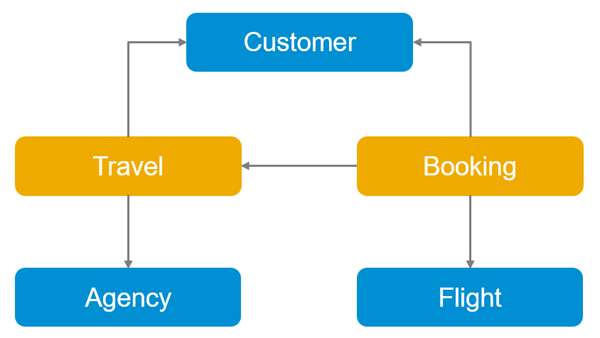
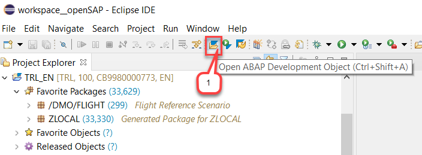
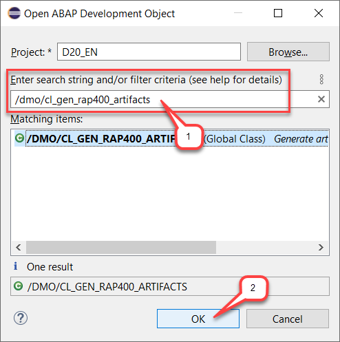
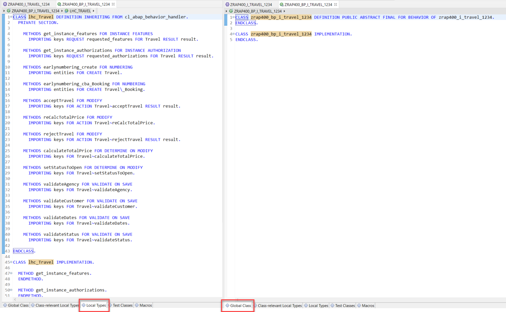
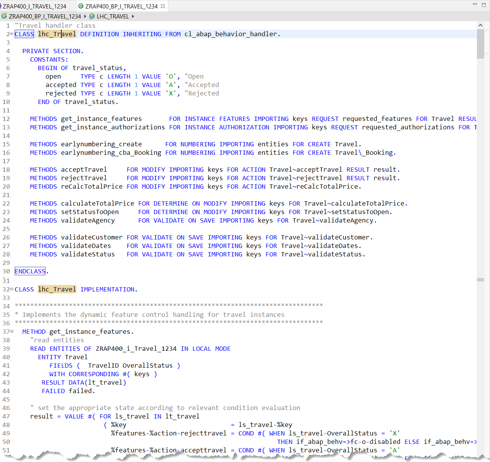
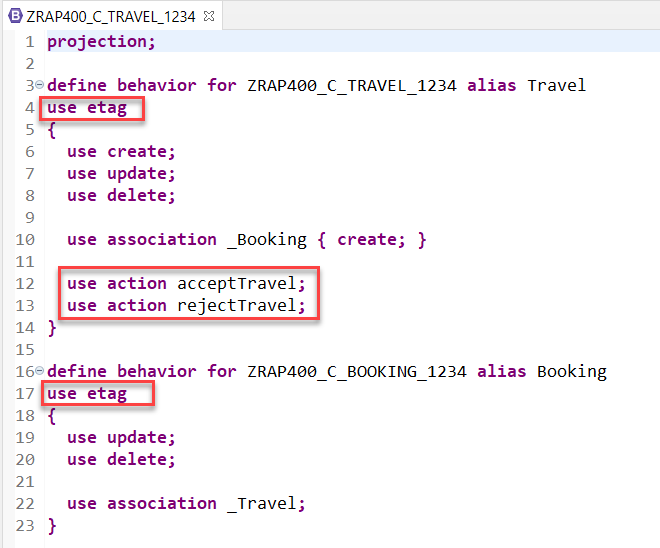
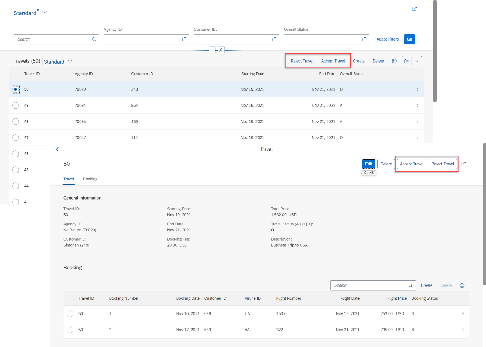

# Exercises 1 - Build Your transactional UI Service

## Introduction
The focus of this session is on learning how to create ABAP unit tests for services built with the ABAP RESTful Application Programming Model (RAP). To speed up the implementation of the UI service in this exercise, we will use a helper class to generate a basic transactional OData service with _managed_ implementation type, and then enhance its transactional behavior with BO specific business logic.

The data model underlying the current UI service consists of two main entities **_Travel_** and **_Booking_**, the transation data, as well as some master data, such as *Agency*, *Customer* and *Flight*, re-uded from the existing _ABAP Flight Reference Scenario_(main package: `/DMO/FLIGHT`) demo content. A _**Travel**_ entity defines general travel data, such as the agency ID or customer ID, the overall status of the travel and the price of travel. A _**Booking**_ entity comprises general flight and booking data, the customer ID for whom the flight is booked as well as the travel ID to which the booking belongs to – and some admin fields.

## Exercise 1.1 - Generate the basic transactional UI Service 

In the ABAP trial systems we have provided the helper class **`/dmo/cl_gen_rap400_artifacts`** to generate the different RAP artifacts of the basic UI service. The helper class will also fill some demo data into the generated _travel_ and _booking_ database tables using demo data provided by the _ABAP Flight Reference Scenario_.   
  
1. Select the **Open ABAP Development Object** icon or press **Ctrl+Shift+A**. 

   

2. Enter **`/dmo/cl_gen_rap400_artifacts`** as search string, select the class and press **OK** in the apperaring dialog.      

   

2. The class **`/dmo/cl_gen_rap400_artifacts`** is displayed in the class editor.

    
  
3. Press **F9** to run the ABAP class as a console application. As a result, you will see a success message in the Console.     

     

4. Please note down your group ID **`####`** and copy the name of the newly created package **`ZRAP400_TRAVEL_####`**
    <pre>
     **************************************************************************************************** 
     **                    Generation for the RAP400 Workshop (yyyymmdd hhmmss UTC)                    ** 
     **************************************************************************************************** 
     - Group ID (suffix): #### 
     - Package: ZRAP400_TRAVEL_#### (superpackage: ZLOCAL)
      ...
     </pre>
   
5. Go to the _**Project Explorer**_, right-click on the folder **Favorite Packages** and select **Add Package...**.
    Enter the name of your package **`ZRAP400_TRAVEL_####`**, where `####`is your group ID, and press **OK**. 

   
   
6. You can open your exercise package **`ZRAP400_TRAVEL_####`** and have a look at the generated artifacts.  
       
      
    
    Following artifacts have been generated by the helper class (where `####` is your assigned group ID): 
    
    - **Your exercise package** (`ZRAP400_TRAVEL_####`) 
    - **2 Database tables** (`ZRAP400_TRAV####` and `ZRAP400_BOOK####`) with semantic keys to store the *travel* and *booking* data, both tables filled with some sample data. 
    - **2 BO Interface Views (CDS views)** (`ZRAP400_I_TRAVEL_####` and `ZRAP400_I_BOOKING_####`) for the root entity *travel* and  child entity *booking* (CDS composition model).
    - **2 BO Projection Views (CDS projection views) ** - aka Consumption Views - (`ZRAP400_C_TRAVEL_####` and `ZRAP400_C_BOOKING_####`) for the root entity *travel* and child entity *booking* (CDS data model projection). 
    - **2 CDS Metadata Extensions** (`ZRAP400_C_TRAVEL_####` and `ZRAP400_C_BOOKING_####`) to enrich the BO projection views of the *travel* and the *booking* entities with UI semantics for the later rendering of the SAP Fiori Elements app (CDS annotations).
    - **2 Behavior Definition** (`ZRAP400_I_TRAVEL_####` and `ZRAP400_C_TRAVEL_####`) of resp. `managed` and `projection` implementation type with standard CRUD operations.
    - **1 Service Definition** (`ZRAP400_C_TRAVEL_####`) to define the service scope - i.e., the relevant entity sets for our service and also provide local aliases if needed.
    - **1 Service Binding** (`ZRAP400_UI_TRAVEL_####`) to expose the generated service definition as OData V2 based UI service.  

   You are through with the generation of your UI service. You can now publish the Local Service Endpoint and preview the SAP Fiori elements app.  

7. Publish the Local Service Endpoint.  
  Open the service binding **`ZRAP400_UI_TRAVEL_####_O2`** and click on the **`Publish`** button in the _**Service Version Details**_ area located on the right-hand side of the editor.
  
  
    
8. Preview the SAP Fiori elements App of the generated UI service: _Travel_ List Report App.  
   
   In the service binding **`ZRAP400_UI_TRAVEL_####_O2`**, go to the _**Entity Set and Association**_ area on the right-hand side and double-click on the **Travel** entity.
   
    

   The App will be displayed in the browser.

     

You can now go ahead and enhance the generated UI service.

## Exercise 1.3 - Enhance the behavior definition  

We want to enhance the standard transactional behavior with some app-specific logic which can then be tested in the next exercises. Due to some current restrictions in the helper class, let's enhance the generated RAP artefacts manually.

1. Open the behavior definition  **`ZRAP400_I_RAP_Travel_####`** by double-clicking on it in the _**Project Explorer**_, and replace its source code with the provided code snippet. 

     For that, delete the complete source code, insert the code snippet provided in the source code document **`ZRAP400_I_RAP_Travel_####`** linked below, and replace all occurrences of **`####`** with your chosen group ID.
    
     **Source code document: [Behavior definition ZRAP400_I_RAP_Travel_####](sources/EX1_BDEF_ZRAP400_I_RAP_Travel.txt)**   
    
    The behavior definition document will now look as follows.
    
      
         
    **What has changed for the *Travel* and the *Booking* entities?**  
    - The instance authorization handling is defined for both entities using the statement **`authorization master ( instance )`** for the root entity _travel_ and **`authorization dependent by _Travel`** for the child entity _booking_ 
    - The early numbering is specified for both entities using the statement **`early numbering`**. This allows you to determine the key of new _travel_ and _booking_ instances at their creation time. 
    - Field control: Some fields such as the entity keys and the administrative fields are set to read-only, and others are set as manadatory.
    - Three (3) actions, incl. an internal action, are defined. 
      - **`acceptTravel`** is used to set the overall status of a travel instance to accepted (`A`)
      - **`rejectTravel`** is used to set the overall status of a travel instance to rejected (`X`)
      - The internal action **`reCalcTotalPrice`** is used to recalculate the total price of a travel instance. 	
    - Two (2) determinations are defined. 
      - **`setStatusToOpen`** will only be triggered at the creation of a new _travel_ instance.  
      - **`calculateTotalPrice`** will be triggered at the creation of a new _travel_ instance, and also at any change of the fields **`BookingFee`**, **`CurrencyCode`**. 	
    - Four (4) validations **`validateCustomer`**, **`validateAgency`**, **`validateDates`**, and **`validateStatus`** to validate respectively the maintained Customers, Agency, dates and overall status entires.
    - When specified, the addition **`( features : instance )`** enables a dynamic feature control of the specific fields or operation.     
	
5. Save  and activate  the changes.  

## Exercise 1.4 - Create the behavior implementation class  
1. Create the _Travel_ behavior implementation (aka _behabvior pool_).
  
    For that, go to the behavior definition **`ZRAP400_I_RAP_TRAVEL_####`**, set the cursor on the specified behavior pool **`zrap400_bp_i_travel_####`**, where `####` is your group ID, and press **Ctrl+1** to open the ADT Quick Fix list. 
  
    Select the entry **`Create behavior implementation class zrap400_bp_i_travel_####`** to create the new class.

        	

2. Provide a transport request if requested and press **Finish**.

      The generated class skeleton on the **_Global class_** and the **_Local Types_** tabs should look as shown on the screenshot below. On the **_Local Types_** tab, you can see the signature of the different methods which need to be implemented to provided the enhanced travel BO specific business logic.
 
        
      
2. On the **_Local Types_** tab and replace the complete generated source code with the provided code snippet.
  
    For that, delete the complete source code, insert the code snippet provided in the source code document **`ZRAP400_BP_I_TRAVEL_####`** linked below, and replace all occurrences of **`####`** with your group ID.

     **Source code document: [Class ZRAP400_BP_I_TRAVEL_####](sources/EX1_CLAS_ZRAP400_BP_I_TRAVEL__lhc_handler.txt)**   

    The behavior implementation class now contains the various method implementations.
    
      
            

3. Save  and activate  the changes.  

## Exercise 1.5 - Enhance the behavior projection  

The newly defined actions **`acceptTravel`** and **`rejectTravel`** defined in the behavior definition **`ZRAP400_I_RAP_Travel_####`** need to be specified in the behavior projection **`ZRAP400_C_RAP_Travel_####`** to be exposed in the Travel App. You will also enable the Etag handling on the projection layer.

1. Open the behavior projection  **`ZRAP400_C_RAP_Travel_####`** by double-clicking on it in the _**Project Explorer**_, and replace its source code with the provided code snippet. 

     For that, delete the complete source code, insert the code snippet provided in the source code document **`ZRAP400_C_RAP_Travel_####`** linked below, and replace all occurrences of **`####`** with your chosen group ID.
    
     **Source code document: [Behavior projection ZRAP400_C_RAP_Travel_####](sources/EX1_BDEF_ZRAP400_C_RAP_Travel.txt)**   
    
    
    The changes should look as follows: 
   
        
   
  
3. Save  and activate  the changes.  

## Exercise 1.6 - Enhance the CDS metadata extension

Last but not least, enhance the CDS metadata extension of the _travel_ entity  **`ZRAP400_C_Travel_####`**, where  **`####`** is your group ID,  to expose the actions **`acceptTravel`** and **`rejectTravel`** on the UI. For that, appropriate annotations have to be provided.

1.  Now open the CDS metadata extension **`ZRAP400_C_Travel_####`** by double-clicking on it in the _**Project Explorer**_ and adjust it as described belows.

2. Replace the annotation block specified directly before the field **`OverallStatus`** with the annotation block provided below, to display the new defined both actions on the UI.  
  
	<pre>
	  @UI: {
	      lineItem:       [ { position: 80, importance: #HIGH },
				{ type: #FOR_ACTION, dataAction: 'acceptTravel', label: 'Accept Travel' },
				{ type: #FOR_ACTION, dataAction: 'rejectTravel', label: 'Reject Travel' }  ],
	      identification: [ { position: 80, label: 'Travel Status (A | O | X)' },
				{ type: #FOR_ACTION, dataAction: 'acceptTravel', label: 'Accept Travel' },
				{ type: #FOR_ACTION, dataAction: 'rejectTravel', label: 'Reject Travel' }  ],
	      selectionField: [ { position: 40 } ] }
	</pre>

     
     The changes should look as follows:  
     
         
  
3. Save  and activate  the changes.  
   
 ## Exercise 1.7 - Test the enhanced Travel App

1. If still open, then refresh the browser and test the changes - else go to the service binding and double-click on the **travel** entity to start the Travel App again.

    For example,
    - The validity of entered customer, agency and begin and end date will be checked.
    - When creating a new travel record, the overal status will be set to **'O'** (_open_) if no other value is entered.
    - The _**Reject Travel**_ button will be deactivated for travel record with cancelled status and the _**Accept Travel**_ button will be deactivated for accepted overall status.
    - The _**Accept Travel**_ button offers a on-click action to set the overall status of an open or cancelled _Travel_ instance to **`A`** (_accepted_).
    - The _**Reject Travel**_ button offers a on-click action to set the overall status of an open or accepter _Travel_ instance to **`X`** (_cancelled_).
  
            
 
 
## Summary

Now that you've... 
- create a helper class and generate a transactional RAP service data model,
- and enhanced the transactional behavior of the business object

you can continue with next exercise.

## Next Exercise

[Exercise 2 - Write local ABAP Unit Tests using Method Invocation](../ex2/README.md)

## Appendix
Find the source code for the helper class, the behavior definition and the behavior projection in the [sources](sources) folder. Don't forget to replace all occurences of the placeholder **`####`** with your group ID.

- [Class ZRAP400_CL_GEN_UI_SERVICE_####](sources/EX1_CLAS_ZRAP400_CL_GEN_UI_SERVICE.txt)
- [Class ZRAP400_BP_I_TRAVEL_#### (_local handler class_)](sources/EX1_CLASS_ZRAP400_BP_I_TRAVEL__lhc_handler.txt)
- [Behavior Definition ZRAP400_I_RAP_TRAVEL_####](sources/EX1_BDEF_ZRAP400_I_RAP_TRAVEL.txt)
- [Behavior Projection ZRAP400_C_RAP_TRAVEL_####](sources/EX1_BDEF_ZRAP400_C_RAP_Travel.txt)
- [CDS Metadata Exetnsion ZRAP400_C_RAP_TRAVEL_####](sources/EX1_DDLX_ZRAP400_C_RAP_Travel.txt)
