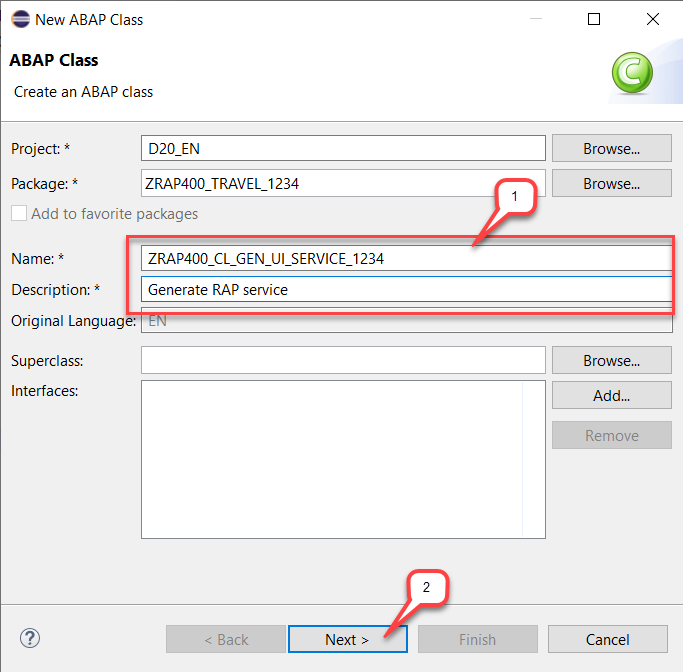
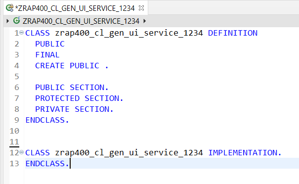
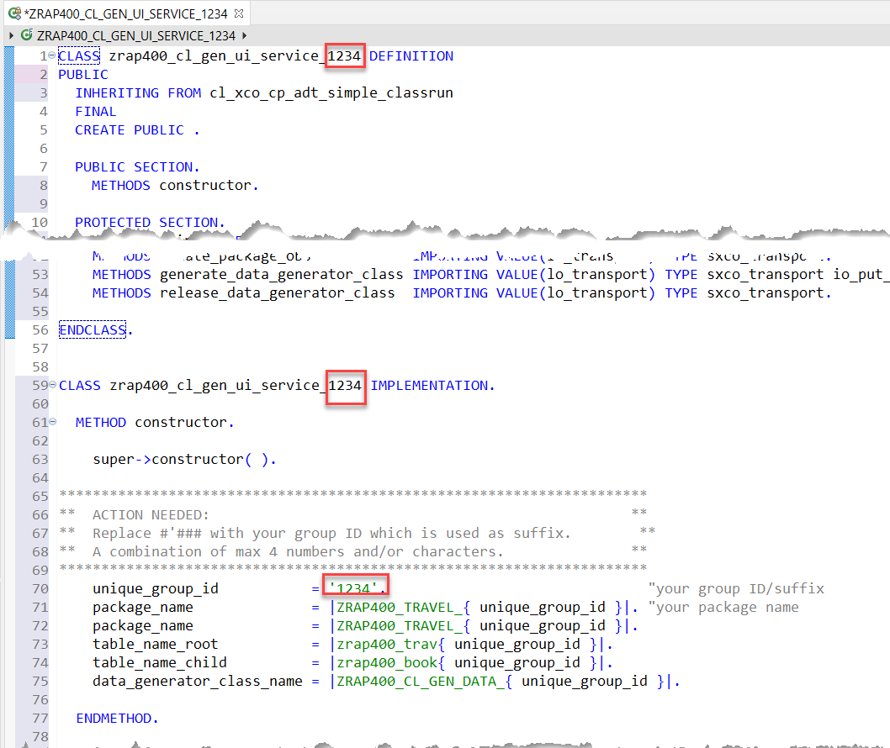
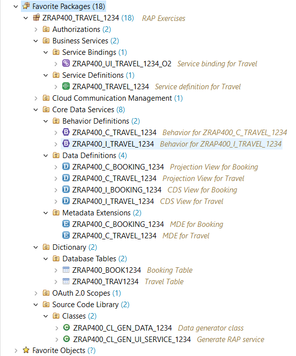
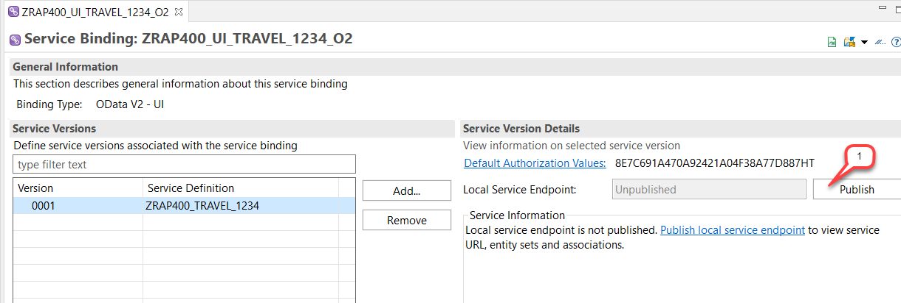
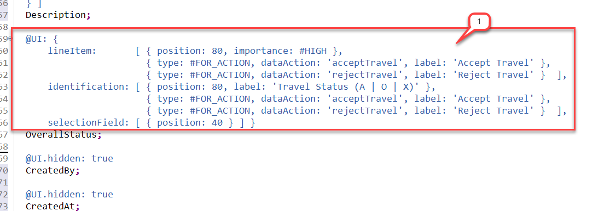

# Exercises 1 - Build Your transactional UI Service

## Introduction
In the current exercise, you will quickly build a RAP service with the managed implementation type that you will use to create different types und ABAP unit Test.

The data model underlying the RAP service consists of two transactional tables (**travel** and **booking**) as well as some master data that we will re-use from the already existing demo content (**Agency**, **Customer** and **Flight**), as well as a few more.  
 
A **Travel** entity defines general travel data, such as the agency ID or customer ID, the overall status of the travel and the price of travel.  

A **Booking** entity comprises general flight and booking data, the customer ID for whom the flight is booked as well as the travel ID to which the booking belongs to – and some admin fields.

You've already chosen a group ID `####` and created the ABAP package **`ZRAP400_TRAVEL_####`** in the previous [Getting Started](/exercises/ex0/README.md) section.

The focus of this session is on learning how to create ABAP unit test for an OData service built with the ABAP RESTful Application Programming Model (RAP).
Therefore, we will generate a standard RAP service and enhanced its transactional behavior with BO specific business logic due to time constrainst.

## Exercise 1.1 - Generate a basic transactional RAP Service 

In the current exercise you will create a helper class which will take care of the generation of the following RAP artefacts:

- **Two database tables** (`ZRAP400_TRAV###*` and `ZRAP400_BOOK###*`) with semantic keys to store the *travel* and *booking* data, both tables filled with some sample data. 
- **Two BO interface views** (`ZRAP400_I_TRAVEL_####` and `ZRAP400_I_BOOKING_####`) for the root entity *travel* and  child entity *booking* (CDS composition model).
- **Two BO projection views** - aka Consumption views - (`ZRAP400_C_TRAVEL_####` and `ZRAP400_C_BOOKING_####`) for the root entity *travel* and child entity *booking* (CDS data model projection). 
- **Two CDS metadata extensions** (`ZRAP400_C_TRAVEL_####` and `ZRAP400_C_BOOKING_####`) to enrich the BO projection views of the *travel* and the *booking* entities with UI semantics for the later rendering of the SAP Fiori Elements app (CDS annotations).
- **Two behavior definition** (`ZRAP400_I_TRAVEL_####` and `ZRAP400_C_TRAVEL_####`) of resp. `managed` and `projection` implementation type with standard CRUD operations.
- **A service definition** (`ZRAP400_C_TRAVEL_####`) to define the service scope - i.e., the relevant entity sets for our service and also provide local aliases if needed.
- **A service binding** (`ZRAP400_UI_TRAVEL_####`) to expose the generated service definition as OData V2 based UI service.  
    
The **helper class** (`ZRAP400_CL_GEN_DEMO_DATA_####`) to fill some demo data into the database tables will also be generated. For this purpose, demo data provided by the ABAP Flight Reference Scenario (main package: `/DMO/FLIGHT`) will be used.

Let's get started! 
  
1. Right-click on your package **`ZRAP400_TRAVEL_####`**, where `####` is your group ID, and choose _**New > ABAP Class**_ from the context menu.      

   

2. Maintain **`ZRAP400_CL_GEN_UI_SERVICE_####`** (where `####` is your group ID) as name and a meaningful description (e.g. **_Generate RAP service_**) in the creation wizard for the new ABAP class and choose **Next**.

   

3. Assign a transport request and choose **Finish**. The new class is now created and the default content displayed in the editor.

   

4. Replace the complete source code of the class with the provided code snippet. 
 
   For that, delete the complete source code, insert the code snippet provided in the source code document **`ZRAP400_CL_GEN_UI_SERVICE_####`** linked below, and replace all occurrences of **`####`** with your chosen group ID.  
               
   > **Hint**: Open the document linked below in a separate windows to keep the exercise flow.
         
    **Source code document: [Class ZRAP400_CL_GEN_UI_SERVICE_####](sources/EX1_CLAS_ZRAP400_CL_GEN_UI_SERVICE.txt)**   
                
   The source code in the ADT editor should now look as follows:

        

5. Save  and activate  the changes.  
  
6. Press **F9** to run the ABAP class as a console application. As a result, you will see a success message in the Console. The various objects have been generated and activated.

      
   
7. Go to your package **`ZRAP400_TRAVEL_####`** in the _**Project Explorer**_ (where `####` is your group ID) and press **F5** to refresh the project explorer. It should now contain the generated objects.  
       
    - Dictionary > Database Tables: **`ZRAP400_TRAV###*`** and **`ZRAP400_BOOK###*`**
    - Core Data Services > Data Definitions: **`ZRAP400_I_TRAVEL_####`**, **`ZRAP400_I_BOOKING_####`**, **`ZRAP400_C_TRAVEL_####`** and **`ZRAP400_C_BOOKING_####`**
    - Core Data Services > Metadata Extensions: **`ZRAP400_C_TRAVEL_####`** and **`ZRAP400_C_BOOKING_####`**
    - Core Data Services > Behavior Definitons: **`ZRAP400_I_TRAVEL_####`** and **`ZRAP400_C_TRAVEL_####`**
    - Business Services > Service Definitons: **`ZRAP400_C_TRAVEL_####`**
    - Business Services > Service Bindings: **`ZRAP400_UI_TRAVEL_####_O2`**   
    - Source Code Library > Classes > **`ZRAP400_CL_GEN_DEMO_DATA_####`**
       
      
            
You are through with the generation.

## Exercise 1.2 – Preview the App
You can now start the SAP Fiori elements App preview of the generated RAP service.

1. Open the Service Binding **`ZRAP400_UI_TRAVEL_####_O2`**  and activate the local service endpoint by pressing the **`Publish`** on the right-hand side in the _**Service Version Details**_ area.       

    
 
2. Preview the Travel List Report App.          

   You can preview and test the generated RAP service by opening the service binding **`ZRAP400_UI_TRAVEL_####_O2`** and double-clicking on the **Travel** entity in the _**Entity Set and Association**_ area on the right-hand side.
   
      
 

      The App will be displayed in the browser.

        

## Exercise 1.3 - Enhance the behavior definition  

We want to enhance the standard transactional behavior with some app-specific logic which can then be tested in the next exercises. Due to some current restrictions in the helper class, let's enhance the generated RAP artefacts manually.

1. Open the behavior definition  **`ZRAP400_I_RAP_Travel_####`** by double-clicking on it in the _**Project Explorer**_, and replace its source code with the provided code snippet. 

     For that, delete the complete source code, insert the code snippet provided in the source code document **`ZRAP400_I_RAP_Travel_####`** linked below, and replace all occurrences of **`####`** with your chosen group ID.
    
     **Source code document: [Behavior definition ZRAP400_I_RAP_Travel_####](sources/EX1_BDEF_ZRAP400_I_RAP_Travel.txt)**   
    
    The behavior definition document will now look as follows.
    
      
         
    **What has changed for the *Travel* and the *Booking* entities?**  
    - The instance authorization handling is defined for both entities using the statement **`authorization master ( instance )`** for the root entity _travel_ and **`authorization dependent by _Travel`** for the child entity _booking_ 
    - The early numbering is specified for both entities using the statement **`early numbering`**. This allows you to determine the key of new _travel_ and _booking_ instances at their creation time. 
    - Field control: Some fields such as the entity keys and the administrative fields are set to read-only, and others are set as manadatory.
    - Three (3) actions, incl. an internal action, are defined. 
      - **`acceptTravel`** is used to set the overall status of a travel instance to accepted (`A`)
      - **`rejectTravel`** is used to set the overall status of a travel instance to rejected (`X`)
      - The internal action **`reCalcTotalPrice`** is used to recalculate the total price of a travel instance. 	
    - Two (2) determinations are defined. 
      - **`setStatusToOpen`** will only be triggered at the creation of a new _travel_ instance.  
      - **`calculateTotalPrice`** will be triggered at the creation of a new _travel_ instance, and also at any change of the fields **`BookingFee`**, **`CurrencyCode`**. 	
    - Four (4) validations **`validateCustomer`**, **`validateAgency`**, **`validateDates`**, and **`validateStatus`** to validate respectively the maintained Customers, Agency, dates and overall status entires.
    - When specified, the addition **`( features : instance )`** enables a dynamic feature control of the specific fields or operation.     
	
5. Save  and activate  the changes.  

## Exercise 1.4 - Create the behavior implementation class  
1. Create the _Travel_ behavior implementation (aka _behabvior pool_).
  
    For that, go to the behavior definition **`ZRAP400_I_RAP_TRAVEL_####`**, set the cursor on the specified behavior pool **`zrap400_bp_i_travel_####`**, where `####` is your group ID, and press **Ctrl+1** to open the ADT Quick Fix list. 
  
    Select the entry **`Create behavior implementation class zrap400_bp_i_travel_####`** to create the new class.

        	

2. Provide a transport request if requested and press **Finish**.

      The generated class skeleton on the **_Global class_** and the **_Local Types_** tabs should look as shown on the screenshot below. On the **_Local Types_** tab, you can see the signature of the different methods which need to be implemented to provided the enhanced travel BO specific business logic.
 
        
      
2. On the **_Local Types_** tab and replace the complete generated source code with the provided code snippet.
  
    For that, delete the complete source code, insert the code snippet provided in the source code document **`ZRAP400_BP_I_TRAVEL_####`** linked below, and replace all occurrences of **`####`** with your group ID.

     **Source code document: [Class ZRAP400_BP_I_TRAVEL_####](sources/EX1_CLAS_ZRAP400_BP_I_TRAVEL__lhc_handler.txt)**   

    The behavior implementation class now contains the various method implementations.
    
      
            

3. Save  and activate  the changes.  

## Exercise 1.5 - Enhance the behavior projection  

The newly defined actions **`acceptTravel`** and **`rejectTravel`** defined in the behavior definition **`ZRAP400_I_RAP_Travel_####`** need to be specified in the behavior projection **`ZRAP400_C_RAP_Travel_####`** to be exposed in the Travel App. You will also enable the Etag handling on the projection layer.

1. Open the behavior projection  **`ZRAP400_C_RAP_Travel_####`** by double-clicking on it in the _**Project Explorer**_, and replace its source code with the provided code snippet. 

     For that, delete the complete source code, insert the code snippet provided in the source code document **`ZRAP400_C_RAP_Travel_####`** linked below, and replace all occurrences of **`####`** with your chosen group ID.
    
     **Source code document: [Behavior projection ZRAP400_C_RAP_Travel_####](sources/EX1_BDEF_ZRAP400_C_RAP_Travel.txt)**   
    
    
    The changes should look as follows: 
   
        
   
  
3. Save  and activate  the changes.  

## Exercise 1.6 - Enhance the CDS metadata extension

Last but not least, enhance the CDS metadata extension of the _travel_ entity  **`ZRAP400_C_Travel_####`**, where  **`####`** is your group ID,  to expose the actions **`acceptTravel`** and **`rejectTravel`** on the UI. For that, appropriate annotations have to be provided.

1.  Now open the CDS metadata extension **`ZRAP400_C_Travel_####`** by double-clicking on it in the _**Project Explorer**_ and adjust it as described belows.

2. Replace the annotation block specified directly before the field **`OverallStatus`** with the annotation block provided below, to display the new defined both actions on the UI.  
  
	<pre>
	  @UI: {
	      lineItem:       [ { position: 80, importance: #HIGH },
				{ type: #FOR_ACTION, dataAction: 'acceptTravel', label: 'Accept Travel' },
				{ type: #FOR_ACTION, dataAction: 'rejectTravel', label: 'Reject Travel' }  ],
	      identification: [ { position: 80, label: 'Travel Status (A | O | X)' },
				{ type: #FOR_ACTION, dataAction: 'acceptTravel', label: 'Accept Travel' },
				{ type: #FOR_ACTION, dataAction: 'rejectTravel', label: 'Reject Travel' }  ],
	      selectionField: [ { position: 40 } ] }
	</pre>

     
     The changes should look as follows:  
     
         
  
3. Save  and activate  the changes.  
   
 ## Exercise 1.7 - Test the enhanced Travel App

1. If still open, then refresh the browser and test the changes - else go to the service binding and double-click on the **travel** entity to start the Travel App again.

    For example,
    - The validity of entered customer, agency and begin and end date will be checked.
    - When creating a new travel record, the overal status will be set to **'O'** (_open_) if no other value is entered.
    - The _**Reject Travel**_ button will be deactivated for travel record with cancelled status and the _**Accept Travel**_ button will be deactivated for accepted overall status.
    - The _**Accept Travel**_ button offers a on-click action to set the overall status of an open or cancelled _Travel_ instance to **`A`** (_accepted_).
    - The _**Reject Travel**_ button offers a on-click action to set the overall status of an open or accepter _Travel_ instance to **`X`** (_cancelled_).
  
            
 
 
## Summary

Now that you've... 
- create a helper class and generate a transactional RAP service data model,
- and enhanced the transactional behavior of the business object

you can continue with next exercise.

## Next Exercise

[Exercise 2 - Write local ABAP Unit Tests using Method Invocation](../ex2/README.md)

## Appendix
Find the source code for the helper class, the behavior definition and the behavior projection in the [sources](sources) folder. Don't forget to replace all occurences of the placeholder **`####`** with your group ID.

- [Class ZRAP400_CL_GEN_UI_SERVICE_####](sources/EX1_CLAS_ZRAP400_CL_GEN_UI_SERVICE.txt)
- [Class ZRAP400_BP_I_TRAVEL_#### (_local handler class_)](sources/EX1_CLASS_ZRAP400_BP_I_TRAVEL__lhc_handler.txt)
- [Behavior Definition ZRAP400_I_RAP_TRAVEL_####](sources/EX1_BDEF_ZRAP400_I_RAP_TRAVEL.txt)
- [Behavior Projection ZRAP400_C_RAP_TRAVEL_####](sources/EX1_BDEF_ZRAP400_C_RAP_Travel.txt)
- [CDS Metadata Exetnsion ZRAP400_C_RAP_TRAVEL_####](sources/EX1_DDLX_ZRAP400_C_RAP_Travel.txt)
