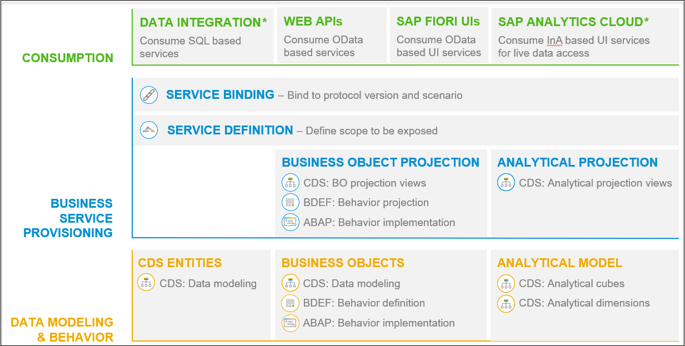
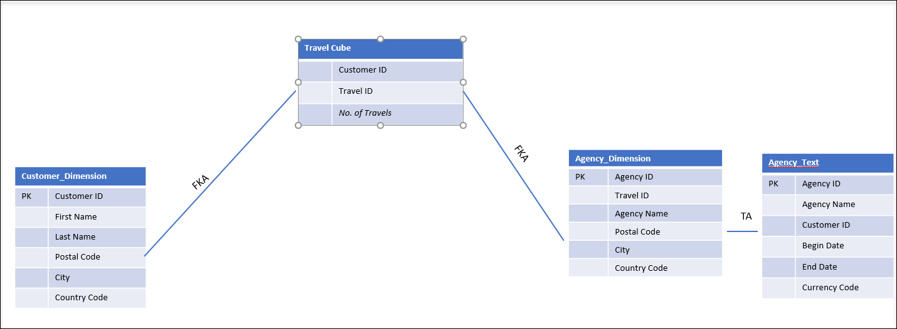

# RAP510 - Developing for Analytics with the SAP BTP ABAP Environment

## Description

This repository contains the material for the hands-on session *RAP500 - Developing for Analytics with the SAP BTP ABAP Environment.*   

It is used for various events such as SAP TechEd, SAP user groups events, etc.

## Requirements needed to participate in this workshop 

> In order to participate in this hands-on session you MUST have installed the latest version of Eclipse and the latest version of the ABAP Development Tools (ADT) in Eclipse.  
> Please check the following two short documents how to do this if you have not already done it.  
> [Install the ABAP Development Tools (ADT)](https://github.com/SAP-samples/abap-platform-rap-workshops/blob/main/requirements_rap_workshops.md#3-install-the-abap-development-tools-adt)  
> [Adapt the Web Browser settings in your ADT installation](https://github.com/SAP-samples/abap-platform-rap-workshops/blob/main/requirements_rap_workshops.md#4-adapt-the-web-browser-settings-in-your-adt-installation)  

## Overview
[^Top of page](README.md)  
A nice overview about the development for Analytics with SAP BTP ABAP Environment can be found in the following blog post [Developing for Analytics with the SAP BTP ABAP Environment](https://blogs.sap.com/2021/02/11/developing-for-analytics-with-the-sap-btp-abap-environment/) by [Andreas Riehl](https://people.sap.com/andreas.riehl)

In the following graphic, the devlopment objects of a RAP based business object (on the left side) are compared with the corresponding analytical development artefacts (on the right side):

## The Big Picture - Service Consumption

 

Development starts in both cases with data modelling based on existing CDS views and tables. The **Analytical Model** is based mainly on **cubes** and **dimensions** that are also modelled in CDS.  

The analytical equivalent to a *projection view* is the *analytical query*. It is based on an analytical cube and is again also an ABAP CDS artefact. The query is then used within service definition and binding via the InA protocol.

*SAP Information Access (InA)* is a REST HTTP-based protocol used by *SAP Analytics Cloud* to query your data sources in real time.

So the analytics developments are really following the same paradigm with CDS views, service definition and binding and use the same data models as a basis – just as you are used to from the RAP style transactional world. The differences (at least from the programming model perspective) are just small additions to adapt to the special needs for analytics:  

The new service binding type InA is tailored to the needs of analytical clients, e.g., to serve different aggregation levels at once and of course additional annotations are needed to describe the semantics that are unique to analytics.

By the way, if you are not familiar yet with the ABAP RESTful Programming Model, there is a great getting started blog post available [Getting Started with the ABAP RESTful Application Programming Model (RAP)](https://blogs.sap.com/2019/10/25/getting-started-with-the-abap-restful-programming-model).

## What are the analytical models?
[^Top of page](README.md) 

 
 
Let us look at the **Travel analytical model**. At its center we find a CDS view entity for travel data, the *cube view*, that pulls together fields from many tables that are involved in the travel booking, like customer ID, agency ID, No.of travels, and so on.

The *cube view* contains dimensional data (= descriptive data such as a travel ID or an customer ID) as well as measurable data (=quantifiable fields that can be calculated, e.g. the number of travels or the total price). We refer to these as **dimension fields** and **measures**.

**Measures** can be aggregated and, if necessary, can have an association to a unit of measure or a currency. Their aggregation behavior is defined via annotation `@Aggregation.default`. If for example the annotation `@Aggregation.default: #SUM` is used, the measures will be summed in an analysis. Measures usually contain **transactional data**

In our Flight Bookings analytical model we have the following *measures*:  

1. Total number of bookings  
2. The total price of a booking  

**Dimension fields** can be used to filter the results of an analysis and to group the result rows of an analysis according to the values of the dimension fields. The more dimension fields a cube contains, the higher the flexibility of possible analyses as there are more options for filtering and grouping the data. Dimension fields usually contain **master data**.

In our Flight Bookings analytical model we have the following *dimensions*:  

1.  Customer
2. Agency  

**Dimension views**

The cube view at the center of our schema references **dimension views** (annotation `@Analytics.dataCategory: #DIMENSION`) which provide additional attributes for the dimension fields in the cube view. The *dimension fields* of the cube are connected to the *dimension views* via foreign key association (annotation `@ObjectModel.foreignKey.association`). The field that is referenced in the association is defined as the representative key of the dimension view (annotation `@ObjectModel.representativeKey`).

Using the dimension view for customer data it is for example possible to retrieve the full name of a customer or the country a customer lives in based on the dimension field *CustomerID* stored in the cube view.

Dimension views can contain **text fields** that are not language dependent, such as the name of a company or the full name of a customer. These are annotated in the dimension view using the annotation `@ObjectModel.text.element`. 

In order to provide language-dependent texts for the dimension fields **text views** (annotation `@objectModel.dataCategory: #TEXT`) are used. They are connected to the dimension fields via a text association (annotation `@ObjectModel.text.association`).  

In this exercise we will only use text fields.

**Analytical Queries**

On top of this analytical model (views with transaction data or master data),  we define **Analytical Queries** as specific CDS View Entities. These views have to contain all fields that are needed for grouping on the query level. If they don't already exist, extended analytical reuse views are created in addition. The query views have to contain all fields, that are relevant for reporting, including calculated fields, master data attributes, and texts.

The analytic queries will not be processed by an SQL engine but by an Analytic Engine, which selects the data via SQL from the views of the underlying analytic model (CUBES, DIMENSIONS, TEXT). Analytical clients like *SAP Analytics Cloud* that query this data are using the RESTful HTTP-based protocol*SAP Information Access (InA)*.

With our flight booking model we can generate the following metrics in different queries:

- Total of travels booked by an agency
- Total price for each travel/customer

Each query will fulfill a specific purpose and it could be designed for different applications (e.g. Reports, KPIs, etc.).  

Let's start creating ABAP CDS views based analytical data models by following the exercices listed below.

## Download and Installation
[^Top of page](README.md)  
You have to download and install the ABAP Development Tools (ADT) as described in section [Requirements](#requirements)

## Known Issues
[^Top of page](README.md)  
This tutorial can only be performed on licensed systems, i.e. SAP BTP ABAP Environment and SAP Analytics Cloud.  

## Exercises
[^Top of page](README.md)  
These are the steps of our hands-ons session: 
    
- [Exercise 1 - Create analytical data model](exercises/ex1/README.md)  
    - [Create a new package](exercises/ex1#Create-a-new-package)
    - [Dimensions](exercises/ex1#dimensions)  
        - [Create the first dimension for Customer](exercises/ex1#create-the-first-dimension-for-customer)    
        - [Add a dimenstion for Agency](exercises/ex1#add-a-dimenstion-for-agency)  
     - [Cube](exercises/ex1#cube)  
     - [Query](exercises/ex1#query)  
     - [Data preview](exercises/ex1#data-preview)
     
- [Exercise 2 - Create and publish Analytical Service](exercises/ex2/README.md)      
     - [Create service defintion](exercises/ex2#create-service-definition)  
     - [Create service binding as InA](exercises/ex2#create-service-binding-as-ina)  
     - [Create IAM app](exercises/ex2#create-iam-app)  
    - [Assign IAM App in business catalog](exercises/ex2#assign-iam-app-in-business-catalog)   
    - [Summary](exercises/ex1#exercises/ex2#summary)     
    
- [Exercise 3 - SAP Analytics Cloud](exercises/ex3/README.md)  
    - [Connect to SAP Analytics Cloud](exercises/ex3#sap-analytics-cloud)  
    - [Create a Model](exercises/ex3#create-model)  
    - [Create a Story](exercises/ex3#create-story)     
    
- [Exercise 4 - Test Live Data Connection](exercises/ex4/README.md)    
    - [Change Data](exercises/ex4#Change-Data)   
    - [Check Live Data Connection](exercises/ex4#Check-Live-Data-Connection)    
   
   
    
## How to obtain support
[^Top of page](README.md)  
Support for the content in this repository is available during the actual time of the online session for which this content has been designed. Otherwise, you may request support via the [Issues](../../issues) tab.

## Further Information
[^Top of page](README.md)  
You can find more information on the SAP Help Portal:  
- [ABAP RESTful Application Programming Model (RAP)](https://help.sap.com/viewer/923180ddb98240829d935862025004d6/Cloud/en-US/289477a81eec4d4e84c0302fb6835035.html) 
- [Analytical Data Modeling & Live Data Connection to SAP Analytics Cloud (SAC)](https://help.sap.com/products/BTP/65de2977205c403bbc107264b8eccf4b/4ae5db4d9bfd472ba70613b358dbb16b.html)  

## License
[^Top of page](README.md)  
Copyright (c) 2020 SAP SE or an SAP affiliate company. All rights reserved. This file is licensed under the Apache Software License, version 2.0 except as noted otherwise in the [LICENSE](LICENSES/Apache-2.0.txt) file.
