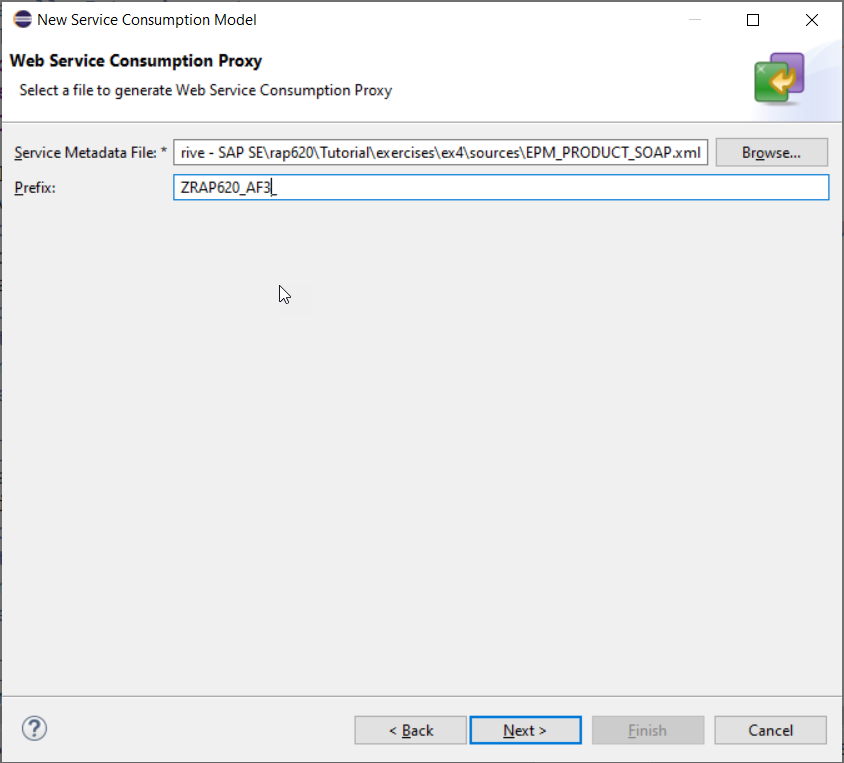
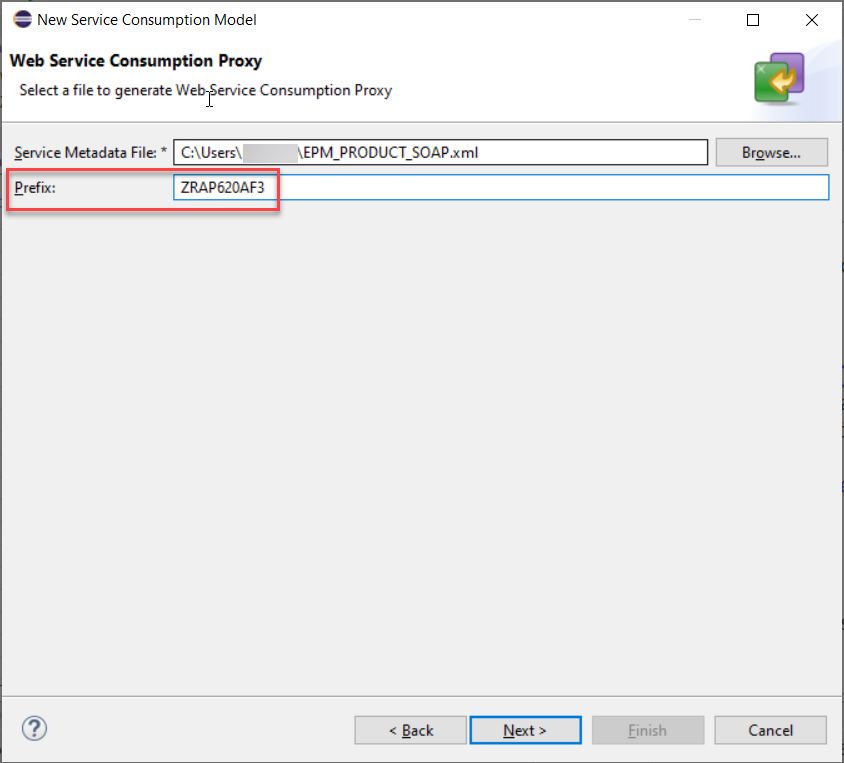
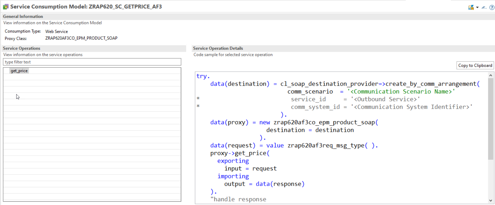
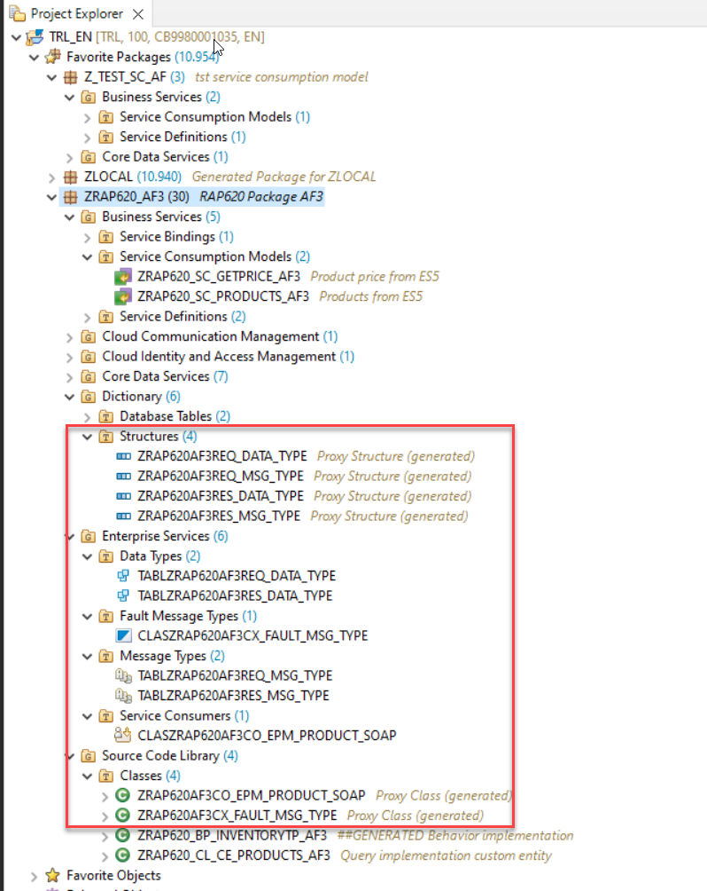
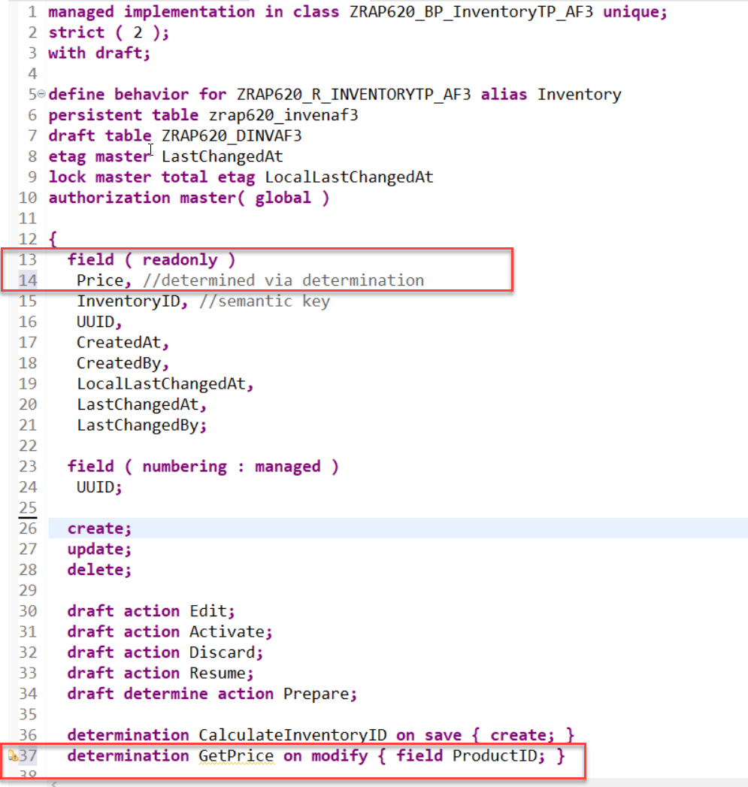

# TOC
[Home](../../readme.md#exercises)
# Exercise 4 - Consume a SOAP Web Service

- [Download the WSDL](#download-the-wsdl)
- [Create the Service Consumption Model](#create-the-service-consumption-model)
- [Add and implement a determination](#add-and-implement-a-determination)
- [Test the service](#test-the-service)
- [Summary](#summary)
- [Solution](#solution)

In the following exercise you will learn how to call a SOAP web service and how to embed this into your inventory application by using it as part of a determination. The SOAP web service that we are going to use is a demo web service available on the SAP Gateway Demo system ES5.

## Download the WSDL
[^Top of page](#)

1. Create a text file with the extension .XML locally on your computer
2. Copy the content of the WSDL file into that file. The WSDL can be found here: [Link to WSDL](sources/EPM_PRODUCT_SOAP.xml) 
or here [raw data](https://raw.githubusercontent.com/SAP-archive/teched2020-DEV268/main/exercises/ex3/sources/EPM_PRODUCT_SOAP.xml)

## Create the Service Consumption Model
[^Top of page](#)

In this step we will create a service consumption model based on the WSDL file that you have downloaded in the previous step.

Click to expand

1. Navigate to the folder **Business Services > Service Consumption Models** 

2. Right-click on the folder **Service Consumption Models**  and choose **New Service Consumption Model**

   
  
3. The New Service Consumption Model dialogue opens. Here enter the following data:

   Name: `ZRAP620_SC_GETPRICE_###`  
   Description: `Product price from ES5`  
   Remote Consumption Model: `Web Service` (to be selected from the drop down box)

   Press **Next** 

   

4. The WSDL file of the SOAP web service that you want to consume must be uploaded in file format. If you have not yet downloaded the WSDL file you have to do this now.

   - Click **Browse** to select the WSDL file that you have downloaded earlier in this exercise
   - Prefix: **`ZRAP620###`**

   

   > **Caution**  
   > Opposed to the prefix that we have chosen for **OData Service Consumption Proxy** we have to choose a leading **Z**.   
   > If not, we get an error message that states:  
   > *Package ZRAP620_### is a customer package, object RAP620### is in SAP namespace.  Use a valid combination of object name*  
   > 
   

5. Selection of transport request

   - Select a transport request
   - Press **Finish** 

6. Service Consumption Model

   The Web Service does only have one service operation `get_price`. 

   > **Please note**  
   > The wizard provides code samples for each service operation. The code can be copied using the the *Copy to clipboard* button.
   > We will not do this since in this exercise since we have provided a detailed code sample (see below) which is however based on the code snippet mentioned above.

   

7. Activate your changes

   Press the  button to generate the service consumption model alongside with all dependend objects.

8. Check generated objects

   When refreshing your package in the *Project Explorer* you will notice that several objects have been generated. For those that are used to the generation of SOAP Web Service proxies in on premise systems they will look familiar.

   

## Add and implement a determination 
[^Top of page](#)

We will use the SOAP web service to retrieve the price of a product.

Click to expand

1. Add a determination in the **behavior definition**

  - Open your behavior definition `ZRAP620_R_INVENTORYTP_###`
  - Add the following code snippets
    - to add a determination for the field `Price`
    - Make the field `Price`also read-only
  
   <pre>
    field ( readonly )
       Price, //determined via determination
   </pre>

   <pre>
   determination GetPrice on modify { field ProductID; }
   </pre>

   

   - Select the determination name `GetPrice` and press **CTRL+1** for a quick fix
   - Double click on the quick fix **Add missing method for determination GetPrice in local handler class ...**

   

2. Add the following code in the implementation of the method `GetPrice`.

   > **Coding explained**  
   > The following code is using large parts of the code snippets provided by the service consumption model.
   > It has however been adjusted to fit our needs.
   > 1. The destination is not retrieved by calling the method `cl_soap_destination_provider=>create_by_cloud_destination( )` but by using the method `cl_soap_destination_provider=>create_by_url( )`. This is because the destination service is not available in the ABAP trial systems in SAP Cloud Platform.
   > 2. Instead of using an inline declaration for `destination`and `proxy` these variables are defined beforehand. This way we can avoid that the destination and proxy object are created several times in case multiple inventories are to be created.
   > 3. The data retrieved from the SOAP call is used to update the inventory data via EML.  
   
   > **Do not forget to search and replace the placeholder `###` with the unique number that you have chosen beforehand.**

<pre>
  
  METHOD GetPrice.
    DATA destination  TYPE REF TO if_soap_destination.
    DATA proxy TYPE REF TO zrap620###co_epm_product_soap.
    DATA reported_inventory_soap LIKE reported-inventory.
    "Ensure idempotence
    READ ENTITIES OF zrap620_r_inventorytp_### IN LOCAL MODE
      ENTITY Inventory
        FIELDS ( Price ProductID )
        WITH CORRESPONDING #( keys )
      RESULT DATA(inventories).

    DELETE inventories WHERE Price IS NOT INITIAL.
    CHECK inventories IS NOT INITIAL.

    DELETE inventories WHERE ProductID =''.
    CHECK inventories IS NOT INITIAL.

    LOOP AT inventories ASSIGNING FIELD-SYMBOL(<inventory>).

      TRY.

          IF destination IS INITIAL.
            destination = cl_soap_destination_provider=>create_by_url( i_url = 'https://sapes5.sapdevcenter.com/sap/bc/srt/xip/sap/zepm_product_soap/002/epm_product_soap/epm_product_soap' ).
          ENDIF.
          IF proxy IS INITIAL.
            proxy = NEW zrap620###co_epm_product_soap(
                             destination = destination
                           ).
          ENDIF.

          DATA(request) = VALUE zrap620###req_msg_type( req_msg_type-product = <inventory>-ProductID ).
          proxy->get_price(
            EXPORTING
              input = request
            IMPORTING
              output = DATA(response)
          ).

          <inventory>-Price = response-res_msg_type-price .
          <inventory>-CurrencyCode = response-res_msg_type-currency.
          "handle response

        CATCH cx_soap_destination_error INTO DATA(soap_destination_error).
          DATA(error_message) = soap_destination_error->get_text(  ).
        CATCH cx_ai_system_fault INTO DATA(ai_system_fault).
          error_message = | code: { ai_system_fault->code  } codetext: { ai_system_fault->codecontext  }  |.
        CATCH zrap620###cx_fault_msg_type INTO DATA(soap_exception).
          error_message = soap_exception->error_text.
          "fill reported structure to be displayed on the UI
          APPEND VALUE #( uuid = <inventory>-uuid
                          %msg = new_message( id = 'ZCM_RAP_GENERATOR'
                                              number = '016'
                                              v1 = error_message
                                              "v2 = messages[ 1 ]-msgv2
                                              "v3 = messages[ 1 ]-msgv3
                                              "v4 = messages[ 1 ]-msgv4
                                              severity = CONV #( 'E' ) )
                           %element-price = if_abap_behv=>mk-on

    ) TO reported_inventory_soap.
          "inventory entries where no price could be retrieved must not be passed to the MODIFY statement
          DELETE inventories INDEX sy-tabix.
      ENDTRY.

    ENDLOOP.

    "update involved instances
    MODIFY ENTITIES OF zrap620_r_inventorytp_### IN LOCAL MODE
      ENTITY Inventory
        UPDATE FIELDS ( Price CurrencyCode )
        WITH VALUE #( FOR inventory IN inventories (
                           %tky      = inventory-%tky
                           Price  = inventory-Price
                           CurrencyCode  = inventory-CurrencyCode
                           ) )
    REPORTED DATA(reported_entities).

    "fill reported
    reported = CORRESPONDING #( DEEP reported_entities ).

    "add reported from SOAP call
    LOOP AT reported_inventory_soap INTO DATA(reported_inventory).
      APPEND reported_inventory TO reported-inventory.
    ENDLOOP.

  ENDMETHOD.

</pre>

3. Activate your changes.

## ⚠ Adapt the behavior definition and the behavior projection
[^Top of page](#)

> ⚠ Caution:   
> The following code changes are currently necessary to avoid a short dump that will be raised because the generated code uses the 
> `strict( 2 ) statement.   

> **Statement "INSERT " is not allowed with this status.**
> **Short Text  Statement "INSERT " is not allowed with this status.**    
> **Runtime Error  BEHAVIOR_ILLEGAL_STATEMENT**    
> **Program  CL_PROXY_DATA=================CP**    

Before we can test the service we have to adapt the code of our behavior definition and our behavior projection.

Click to expand

This is because the generator uses the following statement.
<pre>
strict (2);
</pre>
The use of the `strict(2) ;` statement inforces several checks at runtime which for example forbids the use of `insert <db_table> from table <internal table>.`   
The underlying framework of the SOAP proxy runtime however performs such statements. To work around this problem we have either to comment out the strict statements completely or at least to use the `strict ;` mode rather than the more restrictive `strict (2) ;` mode.

The code of your behavior definition and the behavior projection should read as follows:   

### Behavior projection

<pre>
projection;
//strict ( 2 );
strict ;
use draft;

define behavior for ZRAP620_C_INVENTORYTP_### alias Inventory
use etag

{
  use create;
  use update;
  use delete;

  use action Edit;
  use action Activate;
  use action Discard;
  use action Resume;
  use action Prepare;
}
</pre>

### Behavior definition
[^Top of page](#)

<pre>
managed implementation in class ZRAP620_BP_InventoryTP_### unique;
//strict ( 2 );
strict ;
with draft;

define behavior for ZRAP620_R_INVENTORYTP_### alias Inventory
persistent table zrap620_inven###
draft table zrap620_dinv###
etag master LastChangedAt
lock master total etag LocalLastChangedAt
authorization master ( global )

{
  field ( readonly )
  Price, //determined via determination
  InventoryID, //semantic key
  UUID,
  CreatedAt,
  CreatedBy,
  LocalLastChangedAt,
  LastChangedAt,
  LastChangedBy;

  field ( numbering : managed )
  UUID;

  create;
  update;
  delete;

  draft action Edit;
  draft action Activate;
  draft action Discard;
  draft action Resume;
  draft determine action Prepare;

  determination CalculateInventoryID on save { create; }
  determination GetPrice on modify { field ProductID; }

  mapping for ZRAP620_INVEN###
  {
    UUID = UUID;
    InventoryID = INVENTORY_ID;
    ProductID = PRODUCT_ID;
    Quantity = QUANTITY;
    QuantityUnit = QUANTITY_UNIT;
    Price = PRICE;
    CurrencyCode = CURRENCY_CODE;
    Description = DESCRIPTION;
    OverallStatus = OVERALL_STATUS;
    CreatedBy = CREATED_BY;
    CreatedAt = CREATED_AT;
    LastChangedBy = LAST_CHANGED_BY;
    LastChangedAt = LAST_CHANGED_AT;
    LocalLastChangedAt = LOCAL_LAST_CHANGED_AT;
  }
}
</pre>

## Test the service
[^Top of page](#)

Evantually we can test our service implementation using the SAP Fiori elements preview.   

Click to expand

1. Test service with Fiori Elements preview.  

   - Open the service binding `ZRAP620_UI_INVENTOR_O4_###` (either via **Ctrl+Shift+A** or via navigation in the Project Explorer)
   - Select the entity `Ìnventory`.
   - Press the **Preview** button
    
   

2. Create a new inventory entry and select a valid product id using the value help

   - Select a valid ProductID via the value help (e.g. HT-1011)
    
     
 
3. Press the **Create** button  

   - When pressing the **Create** button the determination for the price will call the SOAP service
   - The inventory will be created with the price and the currency retrieved from the backend

     

4. Create an inventory entry with an invalid ProductID (e.g. www).  

   Enter an invalid ProductID, e.g. `HT-1011a`  
   
     

   > The error message that we have configured if the SOAP call will not be able to find the ProductId in the backend  `Product not found. Try e.g. HT-1000 :)` will not become visible since we have enabled a validation in the UI.
   
  

## Summary
[^Top of page](#)

In this session you have learned how you can use SAP Cloud Platform, ABAP environment to implement a side-by-side extension scenarios for an SAP S/4 HANA system using the ABAP RESTful Application Programming Model.

You have retrieved data from the SAP S/4HANA system using OData and SOAP based communication to implement

- a value help to select a product for an inventory entry
- a determination for the price of a product

 

In a licensed SAP Cloud Platform, ABAP Environment system you would also be able to create a service consumption model for RFC function modules.

